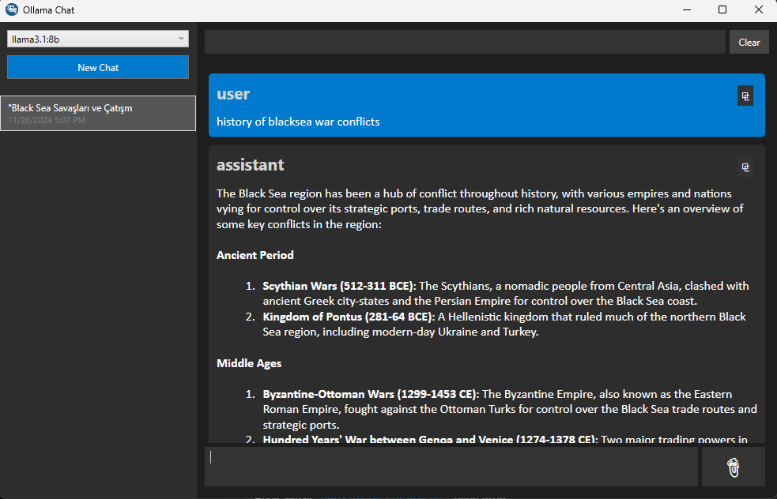

# Local Ollama Chat Client

This WPF application allows users to interact with the locally hosted Ollama server. It provides a user-friendly interface to list all available models, select a specific model, and start chatting. Users can also upload files to enhance the interaction with the selected model.

## Features

- **Connect to a Local Ollama Server**: Seamlessly connect to the Ollama server running on your local machine.
- **List Installed Models**: View a complete list of all models available on the server.
- **Chat with Models**: Select a model and start a conversation with natural language input.
- **File Upload**: Enhance interactions by uploading files for model processing.

## Getting Started

### Prerequisites
- Ensure that the Ollama server is installed and running locally.
- .NET 9.0 or higher must be installed on your system.

